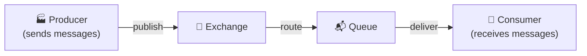
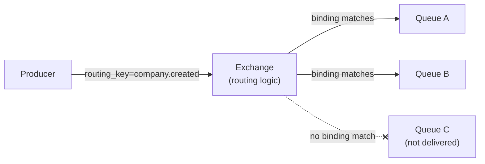
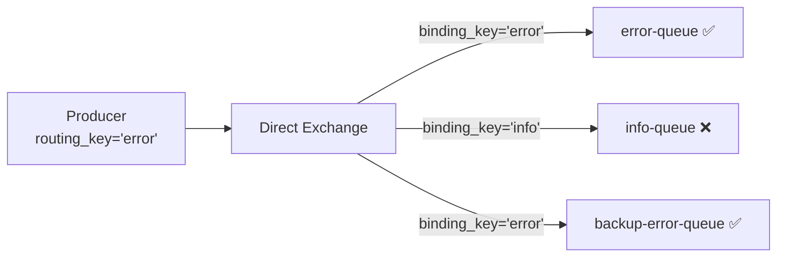
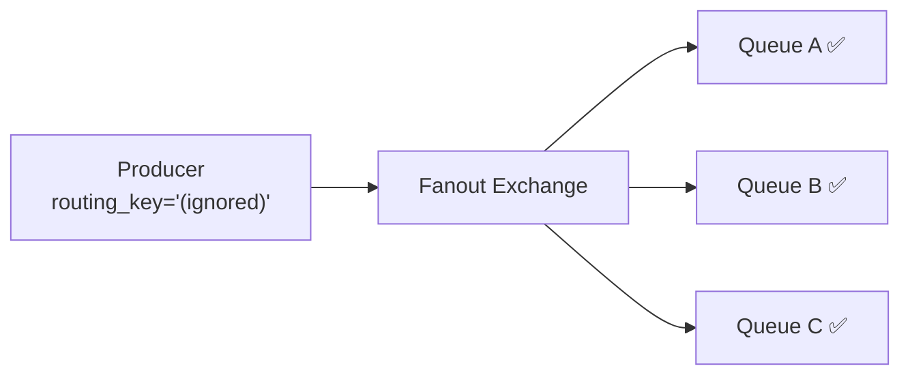
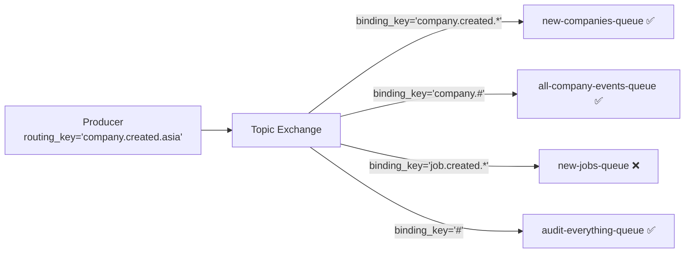
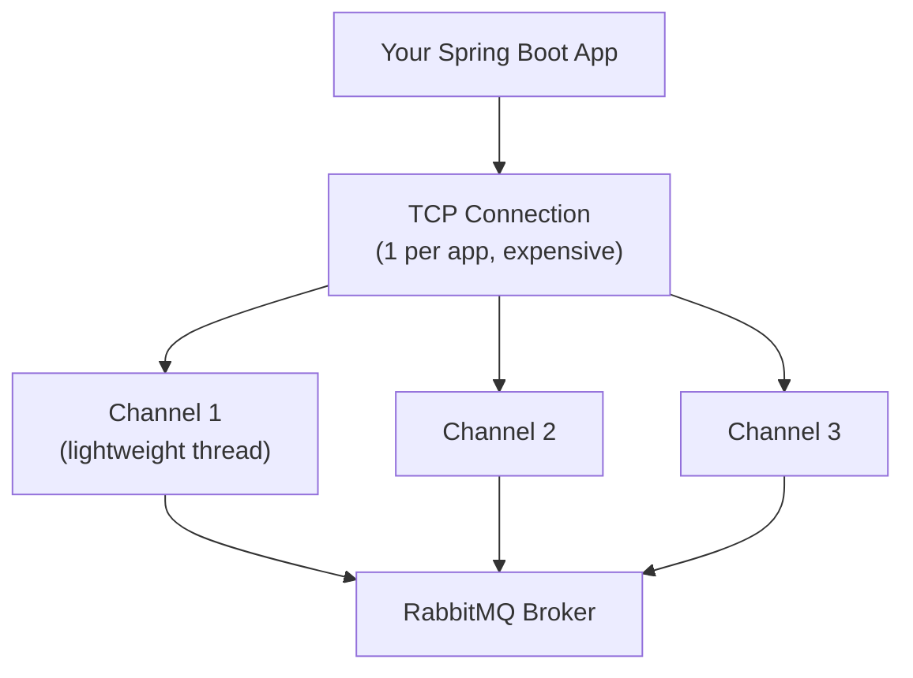
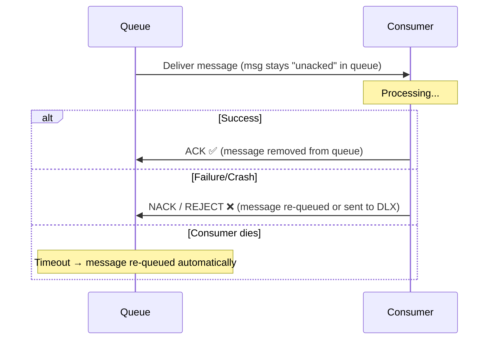
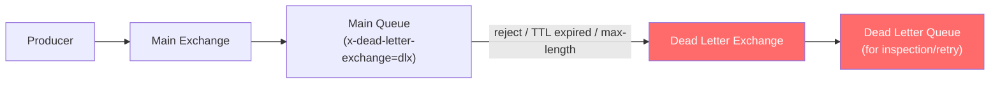
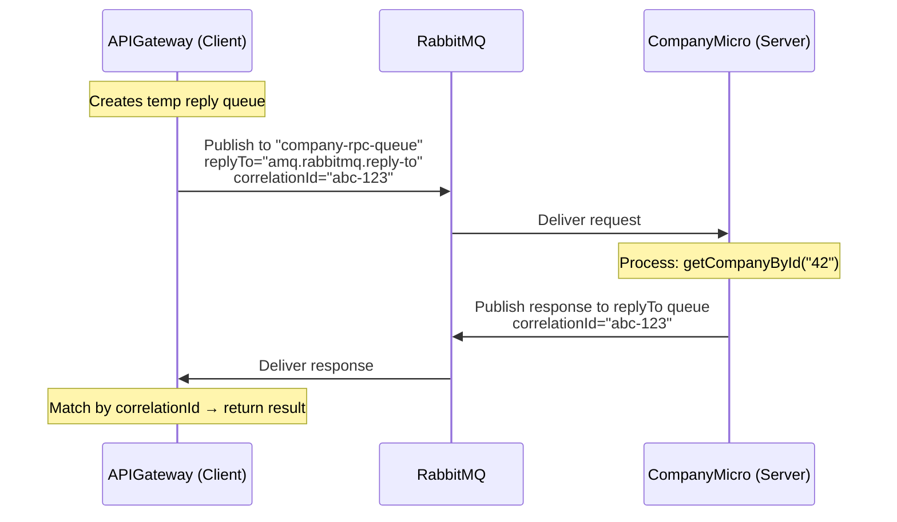
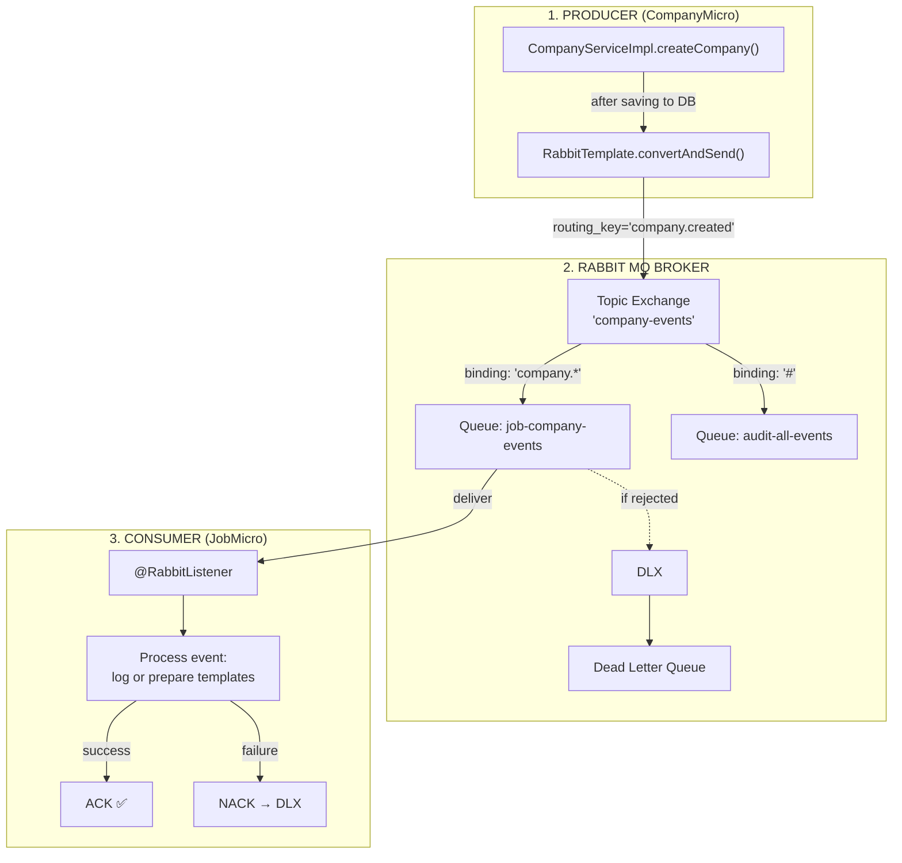

# 🐰 RabbitMQ — From Zero to Microservices

A hands-on tutorial tailored to your **CompanyMicro / JobMicro / APIGateway** project.

---

## Table of Contents

1. [The Big Picture — Why RabbitMQ?](#1-the-big-picture)
2. [Core Concepts (The Mental Model)](#2-core-concepts)
   - [Producer & Consumer](#21-producer--consumer)
   - [Queue](#22-queue)
   - [Exchange](#23-exchange)
   - [Binding & Routing Key](#24-binding--routing-key)
   - [Exchange Types Deep Dive](#25-exchange-types-deep-dive)
   - [Virtual Hosts (vhosts)](#26-virtual-hosts)
   - [Connections & Channels](#27-connections--channels)
   - [Acknowledgements & Message Durability](#28-acknowledgements--message-durability)
   - [Prefetch (QoS)](#29-prefetch-qos)
   - [Dead Letter Exchange (DLX)](#210-dead-letter-exchange-dlx)
   - [TTL (Time-To-Live)](#211-ttl-time-to-live)
   - [The RPC Pattern (Request-Reply)](#212-the-rpc-pattern)
3. [How It All Fits Together — The Full Flow](#3-how-it-all-fits-together)
4. [Hands-On: Integrating RabbitMQ Into Your Project](#4-hands-on-integration)
   - [Phase 1 — Setup & Hello World](#phase-1)
   - [Phase 2 — Fire-and-Forget Events (Fanout)](#phase-2)
   - [Phase 3 — Smart Routing (Topic Exchange)](#phase-3)
   - [Phase 4 — Dead Letter Queue](#phase-4)
   - [Phase 5 — RPC Pattern (Replace REST)](#phase-5)
5. [Cheatsheet & Quick Reference](#5-cheatsheet)

---

## 1. The Big Picture — Why RabbitMQ? {#1-the-big-picture}

### What you have today

```
┌──────────┐   REST (sync)   ┌──────────────┐   REST (sync)   ┌──────────┐
│ APIGateway│ ──────────────► │ CompanyMicro  │                │ JobMicro  │
│ :8082     │                │ :8081         │                │ :8080     │
│           │ ──────────────────────────────────────────────► │           │
└──────────┘                 └──────────────┘                └──────────┘
```

**Problems with pure REST:**
| Problem | Example in your code |
|---|---|
| **Tight coupling** | `AggregatorServiceImpl` directly calls `CompanyClient.getCompanyById()` and `RestTemplate.getForObject("http://localhost:8080/...")` |
| **Cascading failure** | If JobMicro is down, the entire `/aggregate/{companyId}` call fails (you added Resilience4j to handle this!) |
| **No buffering** | If CompanyMicro gets 10,000 requests/sec, it either handles them all or drops them |
| **Synchronous blocking** | The caller waits the entire time until the response comes back |

### What RabbitMQ gives you

```
┌──────────┐              ┌──────────┐              ┌──────────────┐
│ APIGateway│  ──publish──►│ RabbitMQ │  ──deliver──►│ CompanyMicro  │
│ (Producer)│              │ (Broker) │              │ (Consumer)    │
└──────────┘              │          │              └──────────────┘
                          │          │  ──deliver──►┌──────────┐
                          │          │              │ JobMicro  │
                          └──────────┘              │ (Consumer)│
                                                    └──────────┘
```

- **Decoupled** — Producer doesn't know/care who consumes
- **Buffered** — Messages queue up if the consumer is slow or down
- **Async** — Fire-and-forget, or request-reply when you need a response
- **Reliable** — Messages survive broker restarts (when configured for durability)

---

## 2. Core Concepts (The Mental Model) {#2-core-concepts}

> [!TIP]
> Think of RabbitMQ as a **post office**. You (Producer) drop a letter (Message) at the sorting center (Exchange). The postal rules (Bindings + Routing Keys) decide which mailbox (Queue) it goes to. The recipient (Consumer) collects from their mailbox.

### 2.1 Producer & Consumer {#21-producer--consumer}



| Term | What it is | In your project |
|------|-----------|-----------------|
| **Producer** | Any application that **sends** a message to RabbitMQ | `CompanyMicro` publishing a "company.created" event |
| **Consumer** | Any application that **receives** a message from a queue | `JobMicro` listening for the "company.created" event |
| **Message** | The data payload (JSON, plain text, binary) + metadata headers | `{ "id": "abc-123", "name": "Google", "description": "..." }` |

**Key insight:** A service can be BOTH a producer and a consumer. `CompanyMicro` might produce "company.created" events AND consume "job.assigned" events.

---

### 2.2 Queue {#22-queue}

A **queue** is a buffer that stores messages until a consumer picks them up.

```
┌─────────────────────────────────────────────┐
│  Queue: "company-events-queue"              │
│  ┌─────┐ ┌─────┐ ┌─────┐ ┌─────┐ ┌─────┐  │
│  │ msg5│ │ msg4│ │ msg3│ │ msg2│ │ msg1│──►│ Consumer picks up msg1 first (FIFO)
│  └─────┘ └─────┘ └─────┘ └─────┘ └─────┘  │
└─────────────────────────────────────────────┘
```

**Properties:**
| Property | Meaning |
|----------|---------|
| `durable` | Queue survives broker restart (saved to disk) |
| `exclusive` | Only the connection that created it can use it; deleted when connection closes |
| `autoDelete` | Queue is deleted when the last consumer unsubscribes |
| `arguments` | Extra config like DLX, TTL, max length, etc. |

> [!IMPORTANT]
> **Queues are where messages live.** Exchanges don't store messages — they just route. If there's no queue bound to an exchange, the message is **silently dropped**.

---

### 2.3 Exchange {#23-exchange}

An **exchange** is the routing engine. Producers NEVER send messages directly to a queue. They send to an exchange, and the exchange decides which queue(s) get the message.



Think of it as a **mail sorting machine** — it reads the address (routing key) and puts the letter in the right bin (queue).

---

### 2.4 Binding & Routing Key {#24-binding--routing-key}

These two work together as the **routing rules**.

| Term | Analogy | Definition |
|------|---------|------------|
| **Binding** | A wire connecting exchange → queue | A rule that tells the exchange: "send messages matching X to this queue" |
| **Routing Key** | The address on the envelope | A string set by the producer when publishing a message |
| **Binding Key** | The filter/pattern on the mailbox | A pattern set when creating the binding (on the queue side) |

**The routing decision:**
```
Producer publishes with routing_key = "company.created"
                    ↓
Exchange looks at all bindings:
  - Queue A bound with binding_key = "company.*"      → ✅ MATCH → deliver
  - Queue B bound with binding_key = "job.created"     → ❌ NO MATCH
  - Queue C bound with binding_key = "company.created" → ✅ MATCH → deliver
```

> [!NOTE]
> The binding key pattern rules (`*` and `#`) only apply to **Topic** exchanges. For **Direct** exchanges, it must be an exact match. For **Fanout**, routing keys are completely ignored.

---

### 2.5 Exchange Types Deep Dive {#25-exchange-types-deep-dive}

This is the **most important concept** in RabbitMQ. There are 4 exchange types:

#### 🔵 Direct Exchange — Exact Match

The most straightforward: message goes to queues whose **binding key exactly matches** the routing key.



**Use case:** Route to a specific queue. Like sending a letter to a specific address.

**Your project example:**
```
routing_key = "company.get.{companyId}"  →  only the CompanyMicro consumer gets it
routing_key = "job.get.{jobId}"          →  only the JobMicro consumer gets it
```

---

#### 🟢 Fanout Exchange — Broadcast to ALL

Ignores the routing key entirely. Every message goes to **every bound queue**.



**Use case:** Notifications, events that everyone needs to know about.

**Your project example:**
```
CompanyMicro publishes "company.created" event
  → JobMicro gets it (to prepare job templates)
  → APIGateway gets it (to invalidate cache)
  → AuditService gets it (to log the event)
All from ONE publish!
```

---

#### 🟡 Topic Exchange — Pattern Matching

The most flexible. Uses wildcard patterns in binding keys:
- `*` (star) = **exactly one word**
- `#` (hash) = **zero or more words**

Words are separated by dots (`.`).



**Pattern examples:**
| Binding Key | Matches | Doesn't Match |
|------------|---------|--------------|
| `company.*` | `company.created`, `company.deleted` | `company.job.created` |
| `company.#` | `company.created`, `company.deleted`, `company.job.created` | `job.created` |
| `*.created` | `company.created`, `job.created` | `company.job.created` |
| `#` | Everything | Nothing (catches all) |

**Your project example:**
```
routing_key = "company.created"  → matched by "company.*" and "company.#"
routing_key = "company.deleted"  → matched by "company.*" and "company.#"
routing_key = "job.created"      → matched by "job.*" or "*.created"
routing_key = "job.updated"      → matched by "job.*"
```

---

#### 🔴 Headers Exchange — Match by Headers (rare)

Routes based on **message header attributes** instead of routing keys. Uses `x-match`:
- `x-match = all` — ALL specified headers must match
- `x-match = any` — ANY ONE header must match

```
Message headers: { "type": "report", "format": "pdf" }
  → Queue A bound with args: { "x-match": "all", "type": "report", "format": "pdf" }  ✅
  → Queue B bound with args: { "x-match": "any", "type": "report", "format": "csv" }  ✅
  → Queue C bound with args: { "x-match": "all", "type": "alert", "format": "pdf" }   ❌
```

> [!NOTE]
> Headers exchanges are rarely used in practice. Topic exchanges cover 95% of use cases. You'll likely never need this.

---

#### 📊 Exchange Comparison Table

| Exchange | Routing Logic | Routing Key Used? | Best For |
|----------|--------------|-------------------|----------|
| **Direct** | Exact match | ✅ Yes (exact) | Point-to-point, specific routing |
| **Fanout** | Broadcast all | ❌ Ignored | Events, notifications, pub-sub |
| **Topic** | Wildcard patterns | ✅ Yes (patterns) | Selective multi-consumer routing |
| **Headers** | Header matching | ❌ Ignored | Complex attribute-based routing |

---

### 2.6 Virtual Hosts (vhosts) {#26-virtual-hosts}

A **vhost** is a logical namespace inside a single RabbitMQ server. Think of it like a database schema.

```
RabbitMQ Server
├── vhost: /production
│   ├── exchange: company-events
│   ├── queue: company-queue
│   └── user: prod-app (permissions: read/write)
│
├── vhost: /staging
│   ├── exchange: company-events    ← same name, totally independent!
│   ├── queue: company-queue
│   └── user: staging-app
│
└── vhost: /              ← default vhost
    └── (your dev stuff)
```

Each vhost has its own exchanges, queues, bindings, and permissions. They're completely isolated.

For learning, you'll use the default vhost `/`.

---

### 2.7 Connections & Channels {#27-connections--channels}



| Term | What | Why |
|------|------|-----|
| **Connection** | A TCP socket between your app and RabbitMQ | Expensive to create/maintain; reuse! |
| **Channel** | A lightweight virtual connection multiplexed inside a connection | Cheap; use one per thread |

> [!TIP]
> Spring AMQP handles this for you automatically. You'll rarely create connections or channels manually.

---

### 2.8 Acknowledgements & Message Durability {#28-acknowledgements--message-durability}

#### What happens when a consumer crashes mid-processing?

Without acknowledgements, the message is **lost forever**. With them:



**Three acknowledgement modes:**

| Mode | Behavior | Risk |
|------|----------|------|
| `AUTO` | Spring auto-acks after listener method returns without exception | Message lost if app crashes AFTER processing but BEFORE ack |
| `MANUAL` | You call `channel.basicAck()` explicitly | Full control; you decide when to ack |
| `NONE` | Fire-and-forget; message removed immediately upon delivery | Message lost if consumer crashes |

**Message durability (surviving broker restart):**
```
Durable message = durable exchange + durable queue + persistent message delivery mode
```

All three must be true for messages to survive a RabbitMQ restart.

---

### 2.9 Prefetch (QoS) {#29-prefetch-qos}

Prefetch controls **how many unacknowledged messages** a consumer can hold at once.

```
Without prefetch (default in some clients):
  Consumer gets ALL messages at once → overwhelmed, out of memory

With prefetch = 5:
  Queue: [msg10][msg9][msg8][msg7][msg6][msg5] ... waiting
  Consumer holds: [msg4][msg3][msg2][msg1][msg0] — processing
  
  Consumer ACKs msg0 → Queue sends msg5 to consumer
```

**Why it matters:** If you have 2 consumers with prefetch=1, messages are distributed fairly (round-robin). Without prefetch, one fast consumer might grab all messages.

In Spring Boot:
```properties
spring.rabbitmq.listener.simple.prefetch=10
```

---

### 2.10 Dead Letter Exchange (DLX) {#210-dead-letter-exchange-dlx}

A DLX is a special exchange where **failed/rejected/expired messages** are sent instead of being lost.



**Messages end up in DLX when:**
1. Consumer **rejects** them (`basicNack` / `basicReject` with `requeue=false`)
2. Message **TTL expires** (sat in queue too long)
3. Queue **max-length** is exceeded (oldest messages overflow)

**This is your safety net.** Instead of losing failed messages, you can:
- Inspect them in the DLQ (dead letter queue)
- Retry them later
- Alert on them

---

### 2.11 TTL (Time-To-Live) {#211-ttl-time-to-live}

Messages can have an expiration time. After it expires, the message is either **dropped** or routed to a **DLX**.

```
Queue-level TTL:       ALL messages in this queue expire after X ms
Message-level TTL:     THIS specific message expires after X ms
```

**Use case:** "If the company.created event hasn't been consumed in 30 minutes, something is wrong — send it to the dead letter queue for investigation."

---

### 2.12 The RPC Pattern (Request-Reply) {#212-the-rpc-pattern}

Sometimes you need a **response** — not just fire-and-forget. RabbitMQ can do synchronous-style request-reply:



**Key properties:**
| Property | Purpose |
|----------|---------|
| `replyTo` | The queue where the server should send the response |
| `correlationId` | A unique ID to match requests with responses (since many requests may be in-flight) |

**Your project example:** Replace this synchronous call:
```java
// Current: blocks until CompanyMicro responds
CompanyDTO company = companyClient.getCompanyById(companyId);
```
With RabbitMQ RPC:
```java
// New: sends message to RabbitMQ, CompanyMicro processes async, response comes back
CompanyDTO company = rabbitTemplate.convertSendAndReceive("company-rpc-exchange", 
    "company.get", companyId);
```

---

## 3. How It All Fits Together — The Full Flow {#3-how-it-all-fits-together}

Here's the complete journey of a message through your system:



**Step by step:**
1. `CompanyMicro` saves a company to the DB
2. After successful save, it **publishes** a message with `routing_key = "company.created"` and the company JSON as payload
3. The message arrives at the **Topic Exchange** `company-events`
4. The exchange matches bindings: `company.*` matches → routes to `job-company-events` queue
5. `JobMicro` has a `@RabbitListener` on that queue — it receives the message
6. If processing succeeds → ACK → message removed
7. If processing fails → NACK → message goes to Dead Letter Queue

---

## 4. Hands-On: Integrating RabbitMQ Into Your Project {#4-hands-on-integration}

> [!IMPORTANT]
> **Prerequisites:** Install RabbitMQ locally. 
> The easiest way on Windows is Docker:
> ```bash
> docker run -d --name rabbitmq -p 5672:5672 -p 15672:15672 rabbitmq:3-management
> ```
> Management UI: http://localhost:15672 (guest/guest)

---

### Phase 1 — Setup & Hello World {#phase-1}

**Goal:** Add RabbitMQ dependency, configure connection, send and receive a simple string message.

#### Step 1.1: Add Dependency to ALL THREE services

Add to `build.gradle` in **CompanyMicro**, **JobMicro**, and **APIGateway**:

```gradle
// RabbitMQ
implementation 'org.springframework.boot:spring-boot-starter-amqp'
```

#### Step 1.2: Configure Connection

Add to `application.properties` (or `application.yml`) in all services:

```properties
# RabbitMQ Connection
spring.rabbitmq.host=localhost
spring.rabbitmq.port=5672
spring.rabbitmq.username=guest
spring.rabbitmq.password=guest
```

#### Step 1.3: Hello World — CompanyMicro Produces

Create a simple test: when a company is created via REST, also publish a message.

```java
// In CompanyMicro — new file: RabbitMQConfig.java
package com.meraproject.companymicro;

import org.springframework.amqp.core.Queue;
import org.springframework.context.annotation.Bean;
import org.springframework.context.annotation.Configuration;

@Configuration
public class RabbitMQConfig {

    // Declare a simple queue
    @Bean
    public Queue helloQueue() {
        return new Queue("hello-queue", true); // durable = true
    }
}
```

```java
// Modify CompanyServiceImpl.java — add RabbitTemplate
package com.meraproject.companymicro;

import org.springframework.amqp.rabbit.core.RabbitTemplate;
import org.springframework.stereotype.Service;
import java.util.Optional;

@Service
public class CompanyServiceImpl implements CompanyService {
    private CompanyRepository companyRepository;
    private RabbitTemplate rabbitTemplate;  // ← NEW

    public CompanyServiceImpl(CompanyRepository companyRepository, 
                              RabbitTemplate rabbitTemplate) {  // ← inject
        this.companyRepository = companyRepository;
        this.rabbitTemplate = rabbitTemplate;
    }

    @Override
    public Company createCompany(Company company) {
        if (company.getId() == null || company.getId().isEmpty()) {
            company.setId(java.util.UUID.randomUUID().toString());
        }
        Company saved = companyRepository.save(company);
        
        // ✨ Publish a message to RabbitMQ!
        rabbitTemplate.convertAndSend("hello-queue", 
            "Company created: " + saved.getName());
        System.out.println("📤 Published message to hello-queue");
        
        return saved;
    }

    // ... rest unchanged
}
```

#### Step 1.4: Hello World — JobMicro Consumes

```java
// In JobMicro — new file: HelloConsumer.java
package com.meraproject.jobmicro;

import org.springframework.amqp.rabbit.annotation.RabbitListener;
import org.springframework.stereotype.Component;

@Component
public class HelloConsumer {

    @RabbitListener(queues = "hello-queue")
    public void receiveMessage(String message) {
        System.out.println("📥 JobMicro received: " + message);
    }
}
```

#### Step 1.5: Test It

1. Start RabbitMQ (Docker)
2. Start CompanyMicro (port 8081)
3. Start JobMicro (port 8080)
4. POST a company:
   ```bash
   curl -X POST http://localhost:8081/companies \
     -H "Content-Type: application/json" \
     -d '{"name": "Google", "description": "Search Engine"}'
   ```
5. Check **JobMicro** console — you should see: `📥 JobMicro received: Company created: Google`
6. Visit http://localhost:15672 → Queues tab → see `hello-queue` and its message count

> [!TIP]
> **Checkpoint:** At this point you understand Producer → Queue → Consumer. The queue was created by `@Bean Queue`, and Spring Boot auto-configured the connection. No exchange was explicitly used — Spring used the **default exchange** (a Direct exchange named `""` that routes to queues by name).

---

### Phase 2 — Fire-and-Forget Events (Fanout Exchange) {#phase-2}

**Goal:** When a company is created/deleted, broadcast an event to ALL interested services using a Fanout exchange.

#### Step 2.1: Create a Shared Event DTO

Create this in **BOTH** CompanyMicro and JobMicro (or in a shared library):

```java
// CompanyEvent.java — in both services
package com.meraproject.companymicro; // or jobmicro

import java.io.Serializable;

public class CompanyEvent implements Serializable {
    private String eventType; // "CREATED", "DELETED"
    private String companyId;
    private String companyName;
    private long timestamp;

    // constructors, getters, setters
    public CompanyEvent() {}
    
    public CompanyEvent(String eventType, String companyId, String companyName) {
        this.eventType = eventType;
        this.companyId = companyId;
        this.companyName = companyName;
        this.timestamp = System.currentTimeMillis();
    }

    // getters and setters ...
}
```

#### Step 2.2: Configure Fanout Exchange (CompanyMicro)

```java
// Update RabbitMQConfig.java in CompanyMicro
package com.meraproject.companymicro;

import org.springframework.amqp.core.*;
import org.springframework.amqp.support.converter.Jackson2JsonMessageConverter;
import org.springframework.context.annotation.Bean;
import org.springframework.context.annotation.Configuration;

@Configuration
public class RabbitMQConfig {

    public static final String COMPANY_EVENTS_EXCHANGE = "company-events-fanout";

    // Exchange — the "sorting center"
    @Bean
    public FanoutExchange companyEventsFanout() {
        return new FanoutExchange(COMPANY_EVENTS_EXCHANGE, true, false);
        //                        name,                     durable, autoDelete
    }

    // Use JSON instead of Java serialization
    @Bean
    public Jackson2JsonMessageConverter jsonMessageConverter() {
        return new Jackson2JsonMessageConverter();
    }
}
```

#### Step 2.3: Publish Events (CompanyMicro)

```java
// Update CompanyServiceImpl.java
@Override
public Company createCompany(Company company) {
    if (company.getId() == null || company.getId().isEmpty()) {
        company.setId(java.util.UUID.randomUUID().toString());
    }
    Company saved = companyRepository.save(company);

    // Publish to fanout exchange (routing key ignored for fanout)
    CompanyEvent event = new CompanyEvent("CREATED", saved.getId(), saved.getName());
    rabbitTemplate.convertAndSend(
        RabbitMQConfig.COMPANY_EVENTS_EXCHANGE,  // exchange
        "",                                       // routing key (ignored by fanout)
        event                                     // message (auto-converted to JSON)
    );
    System.out.println("📤 Published CREATED event for: " + saved.getName());

    return saved;
}

@Override
public void deleteCompany(String id) {
    companyRepository.deleteById(id);

    CompanyEvent event = new CompanyEvent("DELETED", id, null);
    rabbitTemplate.convertAndSend(
        RabbitMQConfig.COMPANY_EVENTS_EXCHANGE, "", event
    );
    System.out.println("📤 Published DELETED event for id: " + id);
}
```

#### Step 2.4: Consume Events (JobMicro)

```java
// RabbitMQConfig.java in JobMicro
package com.meraproject.jobmicro;

import org.springframework.amqp.core.*;
import org.springframework.amqp.support.converter.Jackson2JsonMessageConverter;
import org.springframework.context.annotation.Bean;
import org.springframework.context.annotation.Configuration;

@Configuration
public class RabbitMQConfig {

    public static final String COMPANY_EVENTS_EXCHANGE = "company-events-fanout";
    public static final String JOB_COMPANY_EVENTS_QUEUE = "job-company-events-queue";

    // Declare the same fanout exchange (must match!)
    @Bean
    public FanoutExchange companyEventsFanout() {
        return new FanoutExchange(COMPANY_EVENTS_EXCHANGE, true, false);
    }

    // This service's own queue
    @Bean
    public Queue jobCompanyEventsQueue() {
        return new Queue(JOB_COMPANY_EVENTS_QUEUE, true);
    }

    // BINDING: connect this queue to the exchange
    @Bean
    public Binding bindJobQueueToExchange(Queue jobCompanyEventsQueue, 
                                           FanoutExchange companyEventsFanout) {
        return BindingBuilder.bind(jobCompanyEventsQueue).to(companyEventsFanout);
    }

    @Bean
    public Jackson2JsonMessageConverter jsonMessageConverter() {
        return new Jackson2JsonMessageConverter();
    }
}
```

```java
// CompanyEventConsumer.java in JobMicro
package com.meraproject.jobmicro;

import org.springframework.amqp.rabbit.annotation.RabbitListener;
import org.springframework.stereotype.Component;

@Component
public class CompanyEventConsumer {

    @RabbitListener(queues = RabbitMQConfig.JOB_COMPANY_EVENTS_QUEUE)
    public void handleCompanyEvent(CompanyEvent event) {
        System.out.println("📥 JobMicro received event: " + event.getEventType() 
            + " for company: " + event.getCompanyId());

        switch (event.getEventType()) {
            case "CREATED":
                System.out.println("🏗️ Could auto-create job templates for: " 
                    + event.getCompanyName());
                break;
            case "DELETED":
                System.out.println("🗑️ Could clean up jobs for company: " 
                    + event.getCompanyId());
                break;
        }
    }
}
```

> [!TIP]
> **Checkpoint:** You now understand exchanges, bindings, and fanout routing. The exchange broadcasts to ALL bound queues. If you added a third service with its own queue bound to the same fanout exchange, it would automatically receive all events too — zero changes to CompanyMicro!

---

### Phase 3 — Smart Routing (Topic Exchange) {#phase-3}

**Goal:** Use a Topic exchange so consumers can subscribe to **specific** event types using patterns.

#### Step 3.1: Replace Fanout with Topic Exchange

```java
// Update RabbitMQConfig.java in CompanyMicro
@Configuration
public class RabbitMQConfig {

    public static final String EVENTS_EXCHANGE = "microservice-events-topic";

    @Bean
    public TopicExchange eventsExchange() {
        return new TopicExchange(EVENTS_EXCHANGE, true, false);
    }

    @Bean
    public Jackson2JsonMessageConverter jsonMessageConverter() {
        return new Jackson2JsonMessageConverter();
    }
}
```

#### Step 3.2: Publish with Meaningful Routing Keys

```java
// CompanyServiceImpl — use descriptive routing keys
rabbitTemplate.convertAndSend(
    RabbitMQConfig.EVENTS_EXCHANGE,
    "company.created",                 // ← routing key with semantic meaning
    event
);

// For delete:
rabbitTemplate.convertAndSend(
    RabbitMQConfig.EVENTS_EXCHANGE,
    "company.deleted",
    event
);
```

#### Step 3.3: Selective Subscription (JobMicro)

```java
// RabbitMQConfig.java in JobMicro
@Configuration
public class RabbitMQConfig {

    public static final String EVENTS_EXCHANGE = "microservice-events-topic";

    // Queue that only gets company.created events
    public static final String JOB_NEW_COMPANIES_QUEUE = "job-new-companies-queue";

    // Queue that gets ALL company events
    public static final String JOB_ALL_COMPANY_QUEUE = "job-all-company-events-queue";

    @Bean
    public TopicExchange eventsExchange() {
        return new TopicExchange(EVENTS_EXCHANGE, true, false);
    }

    @Bean
    public Queue newCompaniesQueue() {
        return new Queue(JOB_NEW_COMPANIES_QUEUE, true);
    }

    @Bean
    public Queue allCompanyEventsQueue() {
        return new Queue(JOB_ALL_COMPANY_QUEUE, true);
    }

    // Only "company.created" messages
    @Bean
    public Binding bindNewCompanies(Queue newCompaniesQueue, TopicExchange eventsExchange) {
        return BindingBuilder.bind(newCompaniesQueue)
            .to(eventsExchange)
            .with("company.created");       // ← exact match (no wildcards)
    }

    // ALL company events: company.created, company.deleted, company.updated, etc.
    @Bean
    public Binding bindAllCompanyEvents(Queue allCompanyEventsQueue, TopicExchange eventsExchange) {
        return BindingBuilder.bind(allCompanyEventsQueue)
            .to(eventsExchange)
            .with("company.*");             // ← wildcard: any single word after "company."
    }

    @Bean
    public Jackson2JsonMessageConverter jsonMessageConverter() {
        return new Jackson2JsonMessageConverter();
    }
}
```

```java
// Listeners in JobMicro
@Component
public class CompanyEventConsumer {

    @RabbitListener(queues = "job-new-companies-queue")
    public void handleNewCompany(CompanyEvent event) {
        System.out.println("🆕 New company only: " + event.getCompanyName());
    }

    @RabbitListener(queues = "job-all-company-events-queue")
    public void handleAllCompanyEvents(CompanyEvent event) {
        System.out.println("📋 All company events: " + event.getEventType() 
            + " → " + event.getCompanyId());
    }
}
```

**Test Results:**
```
POST /companies → creates "Google"
  📥 job-new-companies-queue:       "🆕 New company only: Google"         ✅
  📥 job-all-company-events-queue:  "📋 All company events: CREATED → abc" ✅

DELETE /companies/abc-123
  📥 job-new-companies-queue:       (nothing — "company.deleted" ≠ "company.created") ❌
  📥 job-all-company-events-queue:  "📋 All company events: DELETED → abc" ✅
```

---

### Phase 4 — Dead Letter Queue {#phase-4}

**Goal:** Messages that fail processing don't get lost — they go to a DLQ for inspection.

#### Step 4.1: Configure DLX + DLQ (JobMicro)

```java
// Add to RabbitMQConfig.java in JobMicro
public static final String DLX_EXCHANGE = "dead-letter-exchange";
public static final String DLQ_QUEUE = "dead-letter-queue";

@Bean
public DirectExchange deadLetterExchange() {
    return new DirectExchange(DLX_EXCHANGE);
}

@Bean
public Queue deadLetterQueue() {
    return new Queue(DLQ_QUEUE, true);
}

@Bean
public Binding dlqBinding(Queue deadLetterQueue, DirectExchange deadLetterExchange) {
    return BindingBuilder.bind(deadLetterQueue)
        .to(deadLetterExchange)
        .with("dead-letter");
}

// MODIFY the main queue to use DLX
@Bean
public Queue newCompaniesQueue() {
    return QueueBuilder.durable(JOB_NEW_COMPANIES_QUEUE)
        .withArgument("x-dead-letter-exchange", DLX_EXCHANGE)
        .withArgument("x-dead-letter-routing-key", "dead-letter")
        .build();
}
```

#### Step 4.2: Configure Manual Ack

```properties
# application.properties in JobMicro
spring.rabbitmq.listener.simple.acknowledge-mode=manual
spring.rabbitmq.listener.simple.prefetch=5
```

#### Step 4.3: Handle Failures in Consumer

```java
@Component
public class CompanyEventConsumer {

    @RabbitListener(queues = "job-new-companies-queue")
    public void handleNewCompany(CompanyEvent event, Channel channel, 
                                  @Header(AmqpHeaders.DELIVERY_TAG) long tag) 
                                  throws IOException {
        try {
            System.out.println("🆕 Processing: " + event.getCompanyName());
            
            // Simulate processing — if name is "FAIL", throw exception
            if ("FAIL".equals(event.getCompanyName())) {
                throw new RuntimeException("Simulated failure!");
            }

            // Success → ACK
            channel.basicAck(tag, false);
            System.out.println("✅ ACK'd message");

        } catch (Exception e) {
            // Failure → NACK (reject, don't requeue → goes to DLX)
            channel.basicNack(tag, false, false);
            //                      multiple, requeue
            System.out.println("❌ NACK'd message → sent to Dead Letter Queue");
        }
    }
}
```

**Test:**
```bash
# Create a company named "FAIL"
curl -X POST http://localhost:8081/companies \
  -H "Content-Type: application/json" \
  -d '{"name": "FAIL", "description": "This will fail"}'

# Check RabbitMQ Management UI → dead-letter-queue will have the message!
```

---

### Phase 5 — RPC Pattern (Replace REST Calls) {#phase-5}

**Goal:** Replace the synchronous `companyClient.getCompanyById()` Feign call with RabbitMQ request-reply.

This is the most powerful pattern — it lets your APIGateway communicate with CompanyMicro **through RabbitMQ** instead of direct HTTP.

#### Step 5.1: Configure RPC in CompanyMicro (Server Side)

```java
// RabbitMQConfig.java in CompanyMicro — add RPC queue
public static final String COMPANY_RPC_QUEUE = "company-rpc-queue";

@Bean
public Queue companyRpcQueue() {
    return new Queue(COMPANY_RPC_QUEUE, true);
}
```

```java
// New file: CompanyRpcServer.java in CompanyMicro
package com.meraproject.companymicro;

import org.springframework.amqp.rabbit.annotation.RabbitListener;
import org.springframework.stereotype.Component;

@Component
public class CompanyRpcServer {

    private final CompanyService companyService;

    public CompanyRpcServer(CompanyService companyService) {
        this.companyService = companyService;
    }

    @RabbitListener(queues = RabbitMQConfig.COMPANY_RPC_QUEUE)
    public Company handleGetCompany(String companyId) {
        System.out.println("📥 RPC request: getCompanyById(" + companyId + ")");
        
        return companyService.getCompanyById(companyId)
            .orElse(null);
        
        // The RETURN VALUE is automatically sent back to the
        // replyTo queue specified by the caller!
    }
}
```

> [!NOTE]
> Notice how the `@RabbitListener` method **returns a value**. Spring AMQP automatically sends this return value back to the caller's `replyTo` queue using the `correlationId`. You don't need to do any manual reply logic!

#### Step 5.2: Configure RPC in APIGateway (Client Side)

```java
// RabbitMQConfig.java in APIGateway
package com.meraproject.apigateway;

import org.springframework.amqp.core.Queue;
import org.springframework.amqp.support.converter.Jackson2JsonMessageConverter;
import org.springframework.context.annotation.Bean;
import org.springframework.context.annotation.Configuration;

@Configuration
public class RabbitMQConfig {

    public static final String COMPANY_RPC_QUEUE = "company-rpc-queue";

    @Bean
    public Queue companyRpcQueue() {
        return new Queue(COMPANY_RPC_QUEUE, true);
    }

    @Bean
    public Jackson2JsonMessageConverter jsonMessageConverter() {
        return new Jackson2JsonMessageConverter();
    }
}
```

#### Step 5.3: Replace Feign Call with RPC in AggregatorServiceImpl

```java
// Updated AggregatorServiceImpl.java
package com.meraproject.apigateway;

import org.springframework.amqp.rabbit.core.RabbitTemplate;
import org.springframework.stereotype.Service;
import org.springframework.web.client.RestTemplate;

import java.util.List;

@Service
public class AggregatorServiceImpl implements AggregatorService {
    private final RestTemplate restTemplate;
    private final RabbitTemplate rabbitTemplate;  // ← NEW: RabbitMQ

    public AggregatorServiceImpl(RestTemplate restTemplate, 
                                  RabbitTemplate rabbitTemplate) {
        this.restTemplate = restTemplate;
        this.rabbitTemplate = rabbitTemplate;
    }

    @Override
    public CompanyDTO getCompanyWithJobs(String companyId) {
        System.out.println("Fetching company details for companyId: " + companyId);

        // ═══════════════════════════════════════════════════
        // OLD: Synchronous Feign call (HTTP)
        // CompanyDTO company = companyClient.getCompanyById(companyId);
        //
        // NEW: RabbitMQ RPC call! 🐰
        // ═══════════════════════════════════════════════════
        Object response = rabbitTemplate.convertSendAndReceive(
            "",                                    // default exchange
            RabbitMQConfig.COMPANY_RPC_QUEUE,       // routing key = queue name
            companyId                               // message body
        );
        // Convert response to CompanyDTO
        // (in production, use a proper converter)
        CompanyDTO company = convertToCompanyDTO(response);

        // Get jobs (still REST for now)
        JobDTO[] jobs = restTemplate.getForObject(
            "http://localhost:8080/jobs/company/" + companyId, JobDTO[].class);

        company.setJobs(List.of(jobs));
        return company;
    }

    private CompanyDTO convertToCompanyDTO(Object response) {
        // With Jackson2JsonMessageConverter configured on both sides,
        // the response will be a LinkedHashMap that we can convert
        if (response instanceof java.util.Map) {
            @SuppressWarnings("unchecked")
            java.util.Map<String, Object> map = (java.util.Map<String, Object>) response;
            CompanyDTO dto = new CompanyDTO();
            dto.setName((String) map.get("name"));
            dto.setDescription((String) map.get("description"));
            return dto;
        }
        throw new RuntimeException("Unexpected response type: " + response.getClass());
    }

    // ... fallback methods unchanged
}
```

#### Step 5.4: Test the RPC Flow

```bash
# 1. Start RabbitMQ, CompanyMicro, JobMicro, APIGateway

# 2. Create a company first
curl -X POST http://localhost:8081/companies \
  -H "Content-Type: application/json" \
  -d '{"name": "Google", "description": "Search Engine"}'
# → note the returned id: e.g., "abc-123"

# 3. Call the aggregator endpoint
curl http://localhost:8082/aggregate/abc-123
# → CompanyMicro console: "📥 RPC request: getCompanyById(abc-123)"
# → APIGateway gets the response back through RabbitMQ! 🎉
```

---

## 5. Cheatsheet & Quick Reference {#5-cheatsheet}

### Spring AMQP Annotations

| Annotation | Purpose |
|-----------|---------|
| `@RabbitListener(queues = "...")` | Mark a method as a consumer for a queue |
| `@RabbitHandler` | Used with `@RabbitListener` on class level for multiple handlers |
| `@EnableRabbit` | Enable RabbitMQ listener (auto-enabled by Spring Boot) |

### RabbitTemplate Methods

| Method | Pattern | Description |
|--------|---------|-------------|
| `convertAndSend(exchange, routingKey, message)` | Fire-and-forget | Send and don't wait for reply |
| `convertSendAndReceive(exchange, routingKey, message)` | RPC | Send and wait for reply (blocking) |
| `convertSendAndReceive(exchange, routingKey, msg, timeout)` | RPC with timeout | Send and wait, with timeout |

### Queue/Exchange Builder Cheatsheet

```java
// Durable queue with DLX
QueueBuilder.durable("my-queue")
    .withArgument("x-dead-letter-exchange", "dlx")
    .withArgument("x-dead-letter-routing-key", "failed")
    .withArgument("x-message-ttl", 30000)   // 30 seconds
    .withArgument("x-max-length", 10000)     // max 10k messages
    .build();

// Exchange types
new DirectExchange("name", durable, autoDelete);
new FanoutExchange("name", durable, autoDelete);
new TopicExchange("name", durable, autoDelete);
new HeadersExchange("name", durable, autoDelete);

// Bindings
BindingBuilder.bind(queue).to(fanoutExchange);
BindingBuilder.bind(queue).to(directExchange).with("routing-key");
BindingBuilder.bind(queue).to(topicExchange).with("company.*");
```

### application.properties Reference

```properties
# Connection
spring.rabbitmq.host=localhost
spring.rabbitmq.port=5672
spring.rabbitmq.username=guest
spring.rabbitmq.password=guest
spring.rabbitmq.virtual-host=/

# Consumer config
spring.rabbitmq.listener.simple.acknowledge-mode=auto    # auto|manual|none
spring.rabbitmq.listener.simple.prefetch=10
spring.rabbitmq.listener.simple.concurrency=1            # min consumers
spring.rabbitmq.listener.simple.max-concurrency=5        # max consumers
spring.rabbitmq.listener.simple.retry.enabled=true
spring.rabbitmq.listener.simple.retry.max-attempts=3
spring.rabbitmq.listener.simple.retry.initial-interval=1000

# Publisher confirms (for guaranteed delivery)
spring.rabbitmq.publisher-confirm-type=correlated
spring.rabbitmq.publisher-returns=true
```

### Learning Path Summary

```
Phase 1: Hello World          → Producer → Queue → Consumer (no exchange)
Phase 2: Fanout Events         → Fanout Exchange → multiple queues (broadcast)
Phase 3: Topic Routing         → Topic Exchange → selective routing (wildcards)
Phase 4: Dead Letter Queue     → DLX, manual ACK/NACK, failed message safety net
Phase 5: RPC Pattern           → Request-Reply over RabbitMQ (replace REST)
```

> [!TIP]
> **Recommended progression:** Complete each phase one at a time. Test thoroughly using the RabbitMQ Management UI (http://localhost:15672) to visually see queues, exchanges, bindings, and message flow. The UI is your best debugging tool!
