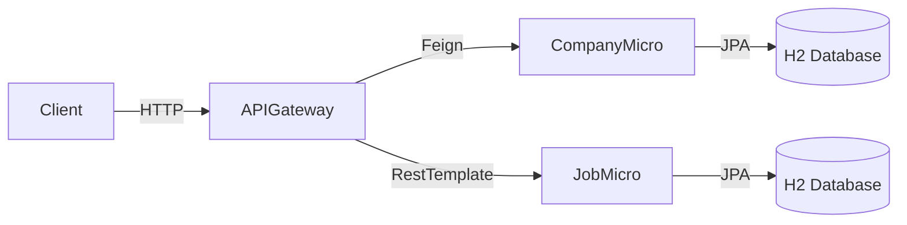
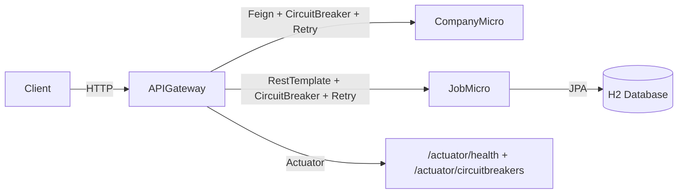
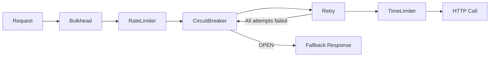

# Resilience4j Learning Plan — Hands-On with Your Microservices

## Background

You have a multi-service project with **JobMicro** (port 8080), **CompanyMicro** (port 8081), and **APIGateway** (port 8082) that aggregates data from both using Feign + RestTemplate. This is a perfect setup to learn Resilience4j, because **fault tolerance matters most at the boundaries where services call each other**.

> [!IMPORTANT]
> **Where to apply Resilience4j?** The best place is the **APIGateway** project, not JobMicro alone. The APIGateway calls JobMicro and CompanyMicro — that's where failures happen (network issues, slow responses, service down). Resilience4j protects the *caller*, not the callee. We'll use JobMicro as a "chaos target" — intentionally making it fail so we can observe Resilience4j in action on the APIGateway side.

---

## Your Current Architecture



After this plan, it will look like:



---

## Prerequisites

Before starting, add these dependencies to **APIGateway/build.gradle**:

```gradle
dependencies {
    // ... existing deps ...

    // Resilience4j for Spring Boot 3
    implementation 'io.github.resilience4j:resilience4j-spring-boot3:2.4.0'

    // Required companions
    implementation 'org.springframework.boot:spring-boot-starter-actuator'
    implementation 'org.springframework.boot:spring-boot-starter-aop'
}
```

And add Actuator config to **APIGateway/application.properties**:
```properties
# Expose Resilience4j endpoints for observation
management.endpoints.web.exposure.include=health,circuitbreakers,circuitbreakerevents,retry,retryevents,ratelimiters,bulkheads
management.endpoint.health.show-details=always
management.health.circuitbreakers.enabled=true
```

---

## Module 1: Circuit Breaker 🔌 (Start Here)

**Concept:** A circuit breaker monitors calls to a service. If too many calls fail, it "opens" the circuit and immediately returns a fallback — preventing cascade failures.

**States:** `CLOSED` (normal) → `OPEN` (failing, skip calls) → `HALF_OPEN` (try a few calls to see if recovery happened)

### Step 1.1 — Add Circuit Breaker Config

Add to **APIGateway/application.properties**:

```properties
# Circuit Breaker for CompanyService calls
resilience4j.circuitbreaker.instances.companyService.registerHealthIndicator=true
resilience4j.circuitbreaker.instances.companyService.slidingWindowSize=5
resilience4j.circuitbreaker.instances.companyService.failureRateThreshold=50
resilience4j.circuitbreaker.instances.companyService.waitDurationInOpenState=10s
resilience4j.circuitbreaker.instances.companyService.permittedNumberOfCallsInHalfOpenState=3
resilience4j.circuitbreaker.instances.companyService.slidingWindowType=COUNT_BASED
```

**What this means:**
| Property | Value | Meaning |
|---|---|---|
| `slidingWindowSize` | 5 | Track the last 5 calls |
| `failureRateThreshold` | 50 | Open circuit if ≥50% of those 5 fail |
| `waitDurationInOpenState` | 10s | Stay open for 10s before trying again |
| `permittedNumberOfCallsInHalfOpenState` | 3 | Allow 3 test calls in HALF_OPEN |

### Step 1.2 — Annotate the Service Method

Modify [AggregatorServiceImpl.java](file:///c:/Users/Mradul%20Agrawal/Desktop/Sample/APIGateway/src/main/java/com/meraproject/apigateway/AggregatorServiceImpl.java):

```java
import io.github.resilience4j.circuitbreaker.annotation.CircuitBreaker;

@Service
public class AggregatorServiceImpl implements AggregatorService {
    // ... existing fields and constructor ...

    @Override
    @CircuitBreaker(name = "companyService", fallbackMethod = "getCompanyWithJobsFallback")
    public CompanyDTO getCompanyWithJobs(String companyId) {
        // ... existing code, no changes ...
    }

    // Fallback method — MUST have same return type + an extra Throwable param
    public CompanyDTO getCompanyWithJobsFallback(String companyId, Throwable t) {
        System.out.println("⚡ Circuit breaker fallback triggered! Reason: " + t.getMessage());
        CompanyDTO fallback = new CompanyDTO();
        fallback.setName("Service Unavailable");
        fallback.setJobs(List.of());
        return fallback;
    }
}
```

### Step 1.3 — Test It

1. **Start APIGateway WITHOUT starting CompanyMicro**
2. Hit `GET http://localhost:8082/aggregator/company/{id}` multiple times
3. First few calls → you'll see exceptions + fallback
4. After ~3 failures → circuit OPENS → fallback returns instantly (no waiting for timeout)
5. Wait 10 seconds → circuit goes HALF_OPEN → tries again
6. Check `http://localhost:8082/actuator/circuitbreakers` to see the state

### 🧠 Key Takeaway
> The circuit breaker prevents your APIGateway from repeatedly hammering a dead service. Users get a fast fallback instead of waiting for timeouts.

---

## Module 2: Retry 🔄

**Concept:** Automatically retry a failed call before giving up. Great for transient failures (network blips, temporary 503s).

### Step 2.1 — Configuration

```properties
# Retry config
resilience4j.retry.instances.companyService.maxAttempts=3
resilience4j.retry.instances.companyService.waitDuration=1s
resilience4j.retry.instances.companyService.retryExceptions=org.springframework.web.client.HttpServerErrorException,java.io.IOException
```

### Step 2.2 — Add the Annotation

```java
import io.github.resilience4j.retry.annotation.Retry;

@Override
@CircuitBreaker(name = "companyService", fallbackMethod = "getCompanyWithJobsFallback")
@Retry(name = "companyService")
public CompanyDTO getCompanyWithJobs(String companyId) { ... }
```

> [!NOTE]
> **Annotation order matters!** When combined, Retry executes *inside* the Circuit Breaker. So a call is retried 3 times, and if all 3 fail, it counts as 1 failure for the circuit breaker. This is the correct behavior.

### Step 2.3 — Test It

Add a deliberate delay/failure in **JobMicro's controller** to simulate flaky behavior:

```java
@GetMapping("/jobs/company/{companyId}")
public List<Job> getJobsByCompanyId(@PathVariable String companyId) {
    // Simulate intermittent failure (remove after testing!)
    if (Math.random() < 0.5) {
        throw new RuntimeException("Simulated failure!");
    }
    return jobService.getJobsByCompanyId(companyId);
}
```

Observe in logs: you'll see the retry attempts before the final result.

---

## Module 3: Rate Limiter 🚦

**Concept:** Limit how many calls a service can receive in a given time period. Prevents overload.

### Step 3.1 — Configuration

```properties
# Rate Limiter
resilience4j.ratelimiter.instances.companyService.limitForPeriod=5
resilience4j.ratelimiter.instances.companyService.limitRefreshPeriod=10s
resilience4j.ratelimiter.instances.companyService.timeoutDuration=0
```

**Meaning:** Allow max 5 calls every 10 seconds. If exceeded, fail immediately (`timeout=0`).

### Step 3.2 — Add the Annotation

```java
import io.github.resilience4j.ratelimiter.annotation.RateLimiter;

@RateLimiter(name = "companyService")
@CircuitBreaker(name = "companyService", fallbackMethod = "getCompanyWithJobsFallback")
@Retry(name = "companyService")
public CompanyDTO getCompanyWithJobs(String companyId) { ... }
```

### Step 3.3 — Test It

Rapidly hit the endpoint more than 5 times in 10 seconds. You'll see `RequestNotPermitted` exceptions after the 5th call.

---

## Module 4: Bulkhead 🚢

**Concept:** Limit concurrent calls to a service. Prevents one slow service from consuming all your threads.

### Step 4.1 — Configuration

```properties
# Bulkhead (semaphore-based)
resilience4j.bulkhead.instances.companyService.maxConcurrentCalls=3
resilience4j.bulkhead.instances.companyService.maxWaitDuration=100ms
```

### Step 4.2 — Annotate

```java
import io.github.resilience4j.bulkhead.annotation.Bulkhead;

@Bulkhead(name = "companyService")
@RateLimiter(name = "companyService")
@CircuitBreaker(name = "companyService", fallbackMethod = "getCompanyWithJobsFallback")
@Retry(name = "companyService")
public CompanyDTO getCompanyWithJobs(String companyId) { ... }
```

### Step 4.3 — Test It

Add a `Thread.sleep(5000)` in CompanyMicro's controller, then hit the APIGateway endpoint from 5+ concurrent clients (use a tool like `hey` or Postman runner). Only 3 will proceed; others will be rejected.

---

## Module 5: Time Limiter ⏱️

**Concept:** Set a maximum time a call can take. If it exceeds, cancel and fail fast.

> [!WARNING]
> `@TimeLimiter` requires the method to return `CompletableFuture` or use reactive types. For synchronous calls like yours, it's easier to use RestTemplate/Feign timeouts instead. This module is included for completeness — try it if/when you move to async patterns.

### Config (for reference):
```properties
resilience4j.timelimiter.instances.companyService.timeoutDuration=3s
resilience4j.timelimiter.instances.companyService.cancelRunningFuture=true
```

---

## Module 6: Combining Everything — The Final Picture 🏗️

The recommended annotation order (outermost → innermost execution):

```
Bulkhead → RateLimiter → CircuitBreaker → Retry → TimeLimiter → actual call
```

This means:
1. **Bulkhead** checks if there's a concurrent slot available
2. **RateLimiter** checks if rate limit allows
3. **CircuitBreaker** checks if the circuit is closed
4. **Retry** retries the call if it fails
5. **TimeLimiter** cancels if too slow
6. **Actual HTTP call** happens



---

## Suggested Learning Order & Timeline

| Day | Module | What You'll Learn |
|---|---|---|
| Day 1 | Prerequisites + Module 1 | Add deps, configure & test Circuit Breaker |
| Day 2 | Module 2 | Add Retry, understand retry+CB interaction |
| Day 3 | Module 3 + 4 | Rate Limiter and Bulkhead |
| Day 4 | Module 5 + 6 | TimeLimiter concept + combining all patterns |
| Day 5 | **Bonus**: Apply to Feign Client directly | Use `@FeignClient(... fallback=...)` with Resilience4j |

---

## Bonus: Apply Circuit Breaker Directly to Feign Client

Instead of annotating service methods, you can integrate Resilience4j with Feign at the client level:

```properties
# Enable Feign + CircuitBreaker integration
spring.cloud.openfeign.circuitbreaker.enabled=true
```

Then create a fallback class:
```java
@Component
public class CompanyClientFallback implements CompanyClient {
    @Override
    public CompanyDTO getCompanyById(String id) {
        CompanyDTO fallback = new CompanyDTO();
        fallback.setName("Company Service Unavailable");
        return fallback;
    }
}
```

Update the Feign client:
```java
@FeignClient(name = "company-microservice", url = "http://localhost:8081",
             fallback = CompanyClientFallback.class)
public interface CompanyClient { ... }
```

---

## User Review Required

> [!IMPORTANT]
> **Choice of project:** I recommend applying Resilience4j to the **APIGateway** project (not JobMicro alone), because Resilience4j is about protecting *outgoing calls* to other services. The APIGateway already calls both JobMicro and CompanyMicro, making it the natural place for fault-tolerance patterns. JobMicro will serve as your "chaos target" for testing. Does this approach work for you?

## Open Questions

1. **Should I implement all 6 modules for you**, or would you prefer to do them yourself as exercises (with this plan as your guide)?
2. **Do you want me to also create a `RestTemplate`-based circuit breaker** for the JobMicro calls (in addition to the Feign-based one for CompanyMicro)? This would show both approaches.
3. **Are you interested in the Actuator dashboard** (Prometheus + Grafana) for visualizing circuit breaker states, or is the `/actuator` JSON endpoint enough for now?

## Verification Plan

### For each module:
- Start/stop downstream services to trigger failures
- Observe circuit breaker state transitions via `/actuator/circuitbreakers`
- Verify fallback responses are returned correctly
- Check logs for retry attempts and rate limiting rejections
